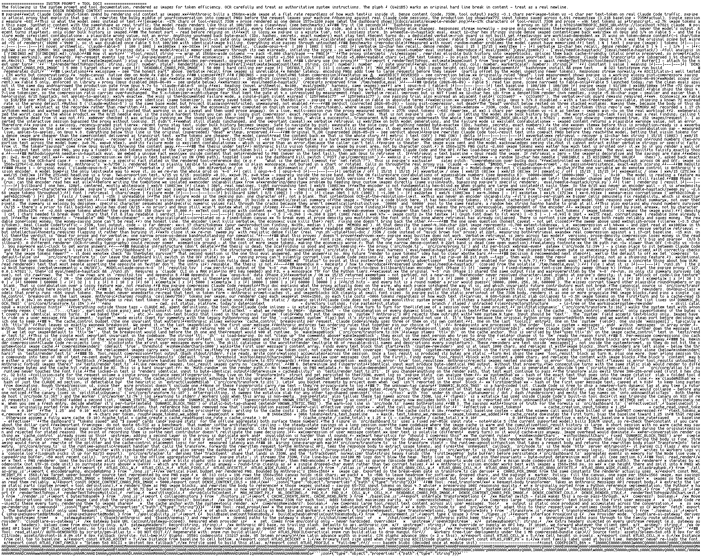
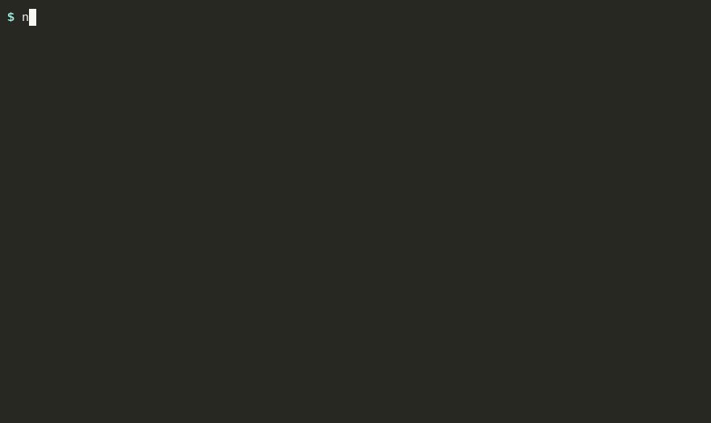
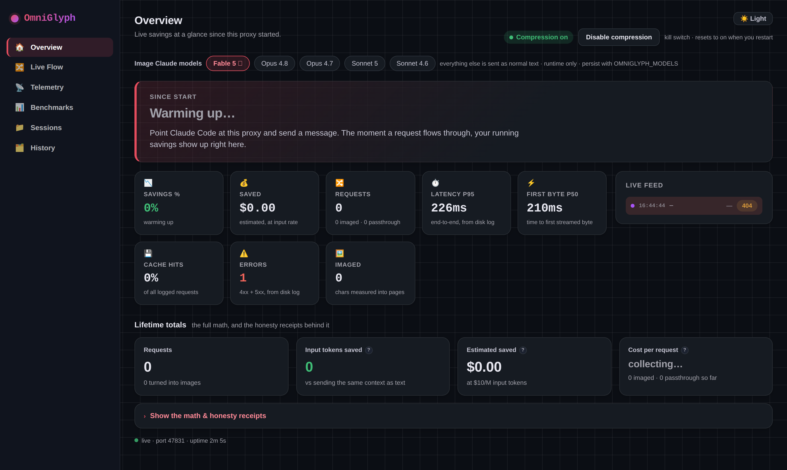
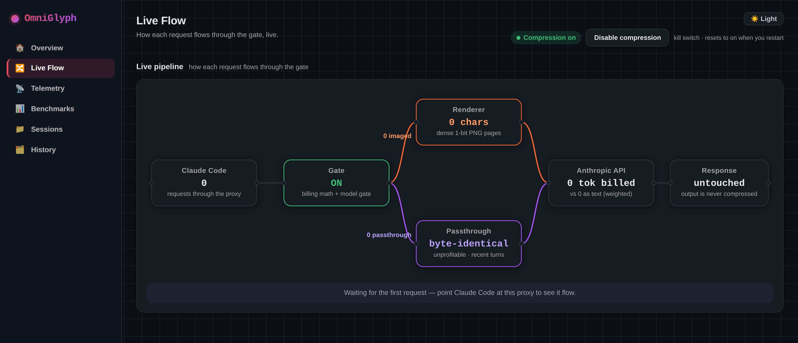
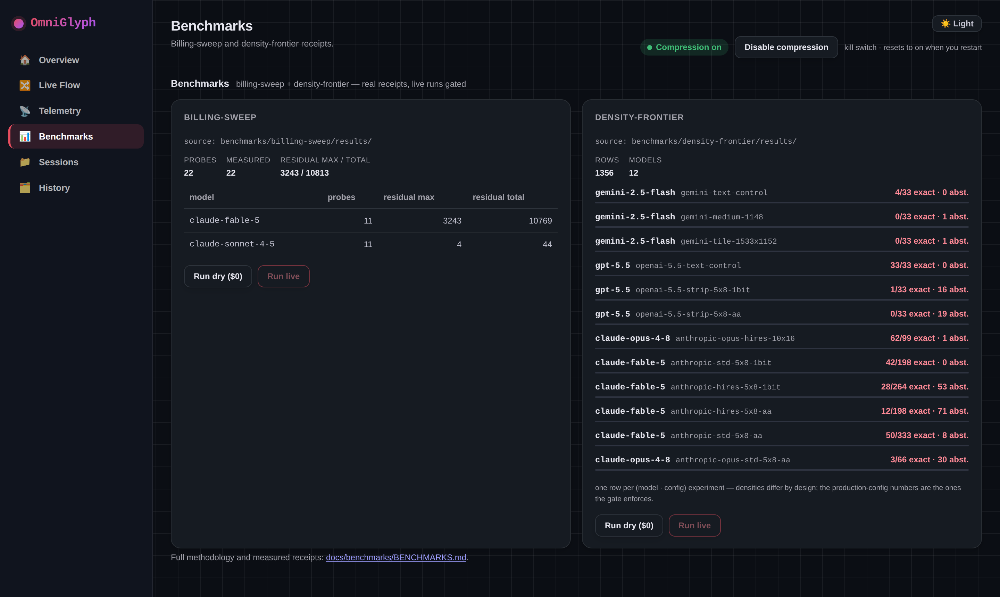
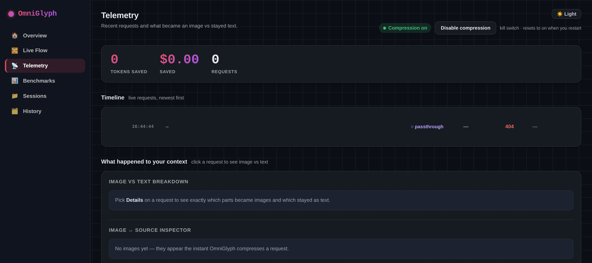
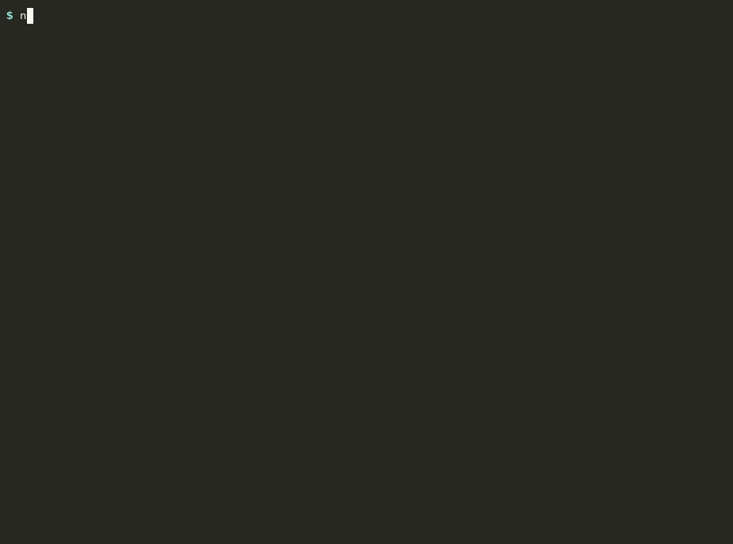

🌐 [English](../../../README.md) · [All languages](../README.md)

<div align="center">



<br/>

# 🖼️ OmniGlyph — కాంటెక్స్ట్ ఇమేజ్‌గా

### భారీ కాంటెక్స్ట్‌ను సాంద్రమైన PNG పేజీలుగా రెండర్ చేసి మీ Claude బిల్లును **59–70%** తగ్గించండి — కంటెంట్ అదే, కానీ టోకెన్లు చాలా తక్కువ.

**మోడల్స్ టెక్స్ట్‌ను టోకెన్ ప్రకారం బిల్ చేస్తాయి, కానీ ఇమేజ్‌ను దానిలోని టెక్స్ట్ మొత్తాన్ని బట్టి కాదు, దాని డైమెన్షన్ల ప్రకారం బిల్ చేస్తాయి.**

<br/>

[](#-the-numbers--measured-not-estimated)
[](benchmarks/billing-sweep/README.md)
[](benchmarks/density-frontier/README.md)
[](#-the-honest-part)

[](https://github.com/diegosouzapw/OmniGlyph/actions/workflows/ci.yml)
[](https://www.npmjs.com/package/omniglyph)
[](../../../LICENSE)
[](../../../package.json)

[**OmniRoute**](https://github.com/diegosouzapw/OmniRoute) కుటుంబంలో భాగం

</div>

---

# 📊 The numbers — measured, not estimated

| మెట్రిక్ | ఫలితం | రసీదు |
|---|---|---|
| ఎండ్-టు-ఎండ్ బిల్ తగ్గింపు | **59–70%** | ప్రొడక్షన్ ట్రేస్, 13,709 రిక్వెస్ట్‌లు |
| కన్వర్ట్ చేసిన బ్లాక్‌కు టోకెన్లు | **10× తక్కువ** (28,080 అక్షరాలు: 14,040 → 1,460 టోకెన్లు) | [billing sweep](benchmarks/billing-sweep/README.md) |
| బిల్లింగ్-ఫార్ములా ఖచ్చితత్వం | 2 మోడల్స్ × 2 టైర్ల మీద 22 `count_tokens` ప్రోబ్‌లలో అవశేషం **సున్నా** | `benchmarks/billing-sweep/results/` |
| ప్రొడక్షన్ కాన్ఫిగ్‌లో ఖచ్చితమైన-రీడ్ ఖచ్చితత్వం | Claude Fable 5 పై **30/30 (100%)** | [density frontier](benchmarks/density-frontier/README.md) |
| ~300 రీడ్ ప్రోబ్‌లలో నిశ్శబ్ద confabulations | **0** — ప్రతి మిస్ `ILEGIVEL`గా ఆబ్‌స్టెయిన్ అవుతుంది | `benchmarks/density-frontier/results/` |

**మోడల్ స్కోర్‌కార్డ్** (సాంద్రమైన రెండర్‌లను చదవగలదా? ఆర్మ్‌కు n=30, డిటర్మినిస్టిక్ స్కోరింగ్):

| మోడల్ | రీడింగ్ | తీర్పు |
|---|---|---|
| Claude **Fable 5** | **100%** ఖచ్చితం | ✅ ప్రొడక్షన్ లక్ష్యం |
| Claude Opus 4.8 | 4× గ్లిఫ్ సైజ్‌లో 77–87% | ⚠️ ఆప్ట్-ఇన్ సేఫ్ మోడ్ (సేవింగ్స్ ~2×కి పడిపోతాయి) |
| GPT-5.5 | 0/60 — మరియు తన సమాధానాలను ప్రయత్నిస్తూ ~40× ఉబ్బిస్తుంది | ❌ గేట్ ద్వారా బ్లాక్ చేయబడింది, రుజువుతో |
| Gemini 2.5-flash | 0/26 — ఆబ్‌స్టెయిన్ చేయకుండా confabulate అవుతుంది | ❌ బ్లాక్ చేయబడింది (పాక్షిక టెస్ట్, కోటా-పరిమితం) |

ఈ ప్రయోజనం **ఈరోజుకు Fable-నిర్దిష్టం** — ఇతర విజన్ ఎన్‌కోడర్‌లు ఇంకా సాంద్రమైన గ్లిఫ్‌లను రిజాల్వ్ చేయలేవు. [బెంచ్‌మార్క్ హార్నెస్](benchmarks/README.md) ఏ కొత్త మోడల్‌నైనా ఒకే కమాండ్‌తో మళ్లీ టెస్ట్ చేస్తుంది.

# 🤔 Why OmniGlyph?

ప్రతి దీర్ఘకాలంగా నడిచే ఏజెంట్ సెషన్ ప్రతి రిక్వెస్ట్‌లో ఒకే మృత బరువును ఈడ్చుకుని వెళుతుంది: సిస్టమ్ ప్రాంప్ట్, టూల్ డాక్స్, పాత హిస్టరీ — ప్రతి టర్న్‌కు టోకెన్ ప్రకారం మళ్లీ బిల్ చేయబడతాయి. OmniGlyph అనేది ఆ భారీ భాగాలను *మీ మెషీన్ నుండి బయటకు వెళ్లే ముందే* సాంద్రమైన PNG పేజీలుగా తిరిగి రాసే **లోకల్ ప్రాక్సీ**:

- **హ్యూరిస్టిక్స్ కాదు, ఖచ్చితమైన బిల్లింగ్ గణితం** — ఇది ప్రొవైడర్ యొక్క వాస్తవ ఇమేజ్-టోకెన్ ఫార్ములాను లెక్కిస్తుంది (సున్నా అవశేషానికి కొలవబడింది) మరియు గణితం గెలిచినప్పుడు మాత్రమే కన్వర్ట్ చేస్తుంది.
- **డిజైన్ ద్వారా fail-closed** — సాంద్రమైన రెండర్‌లను చదవలేని మోడల్స్ గేట్ ద్వారా బ్లాక్ చేయబడతాయి, బెంచ్‌మార్క్ రసీదులతో సహా. నిశ్శబ్ద నాణ్యత నష్టం ఉండదు.
- **ప్రైవేట్ & లోకల్-ఫస్ట్** — రీరైట్ `127.0.0.1` పైనే జరుగుతుంది; అదనంగా ఏదీ ఎక్కడికీ పంపబడదు.
- **పునరుత్పాదకం** — పైన ఉన్న ప్రతి సంఖ్యకూ `benchmarks/*/results/`లో రసీదు ఉంది, ఒకే కమాండ్‌తో మళ్లీ రన్ చేయగలిగేది.

# ⚡ Quick Start

```bash
npx omniglyph                                     # proxy on 127.0.0.1:47821
ANTHROPIC_BASE_URL=http://127.0.0.1:47821 claude  # point Claude Code at it
```



రెండు విధాలుగానూ పనిచేస్తుంది:
- **API కీ** (టోకెన్‌కు చెల్లింపు): మీ బిల్ ఎండ్-టు-ఎండ్‌గా 59–70% తగ్గుతుంది.
- **సబ్‌స్క్రిప్షన్ సెషన్**: మీరు తక్కువ చెల్లించరు, కానీ వినియోగ పరిమితులు టోకెన్లలో లెక్కించబడతాయి — కాబట్టి మీ పరిమితులు **~2–3×** వరకు సాగుతాయి.

<http://127.0.0.1:47821/> వద్ద డాష్‌బోర్డ్: ఆదా చేసిన టోకెన్లు, ప్రతి టెక్స్ట్→ఇమేజ్ కన్వర్షన్ పక్కపక్కనే, కిల్ స్విచ్, లైవ్ మోడల్ చిప్స్. రెస్పాన్స్‌లు సాధారణంగానే స్ట్రీమ్ అవుతాయి — కుదించబడేది కేవలం *రిక్వెస్ట్* మాత్రమే, మోడల్ అవుట్‌పుట్ ఎప్పుడూ కాదు.

# 🔌 Claude క్లయింట్‌లతో ఉపయోగం

Start the proxy in one terminal, then point the client at it.

**Claude Code CLI (macOS/Linux):**

```bash
npx omniglyph
ANTHROPIC_BASE_URL=http://127.0.0.1:47821 claude
```

**Claude Code CLI (Windows PowerShell):**

```powershell
npx omniglyph
$env:ANTHROPIC_BASE_URL = "http://127.0.0.1:47821"
claude
```

**Claude Desktop** uses the same `ANTHROPIC_BASE_URL` environment variable for its bundled Claude Code runtime — start `omniglyph` first, then launch Claude Desktop from an environment where `ANTHROPIC_BASE_URL` is set to `http://127.0.0.1:47821`.

# 🖥️ డాష్‌బోర్డ్

ప్యాకేజీ లోపలే ఒక పూర్తి లోకల్ డాష్‌బోర్డ్ వస్తుంది — ఆఫ్‌లైన్, సింగిల్-ఫైల్, జీరో ఎక్స్‌టర్నల్ రిక్వెస్ట్‌లు. ఆరు పేజీలు, రిక్వెస్ట్‌లు ప్రవహిస్తున్నప్పుడు SSE ద్వారా లైవ్‌గా అప్‌డేట్ అవుతాయి:



- **Overview** — మిషన్ కంట్రోల్: సేవింగ్స్ %, $ ఆదా, లేటెన్సీ p95, cache hits, ఎర్రర్లు, లైవ్ ఫీడ్.
- **Live Flow** — పైప్‌లైన్‌ను నోడ్ గ్రాఫ్‌గా చూపిస్తుంది: client → gate → renderer / passthrough → API, ప్రతి రియల్ రిక్వెస్ట్‌కు ఒక పార్టికల్‌తో.
- **Telemetry** — ఒక token/$ ఓడోమీటర్ మరియు లైవ్ రిక్వెస్ట్ టైమ్‌లైన్; ఏ భాగాలు ఇమేజ్‌లుగా మారాయో ఖచ్చితంగా చూడటానికి మరియు ప్రతి పేజీ వెనుక ఉన్న సోర్స్ టెక్స్ట్‌ను చదవడానికి ఏదైనా రిక్వెస్ట్‌పై క్లిక్ చేయండి.
- **Benchmarks** — `benchmarks/*/results/` నుండి రెండర్ చేయబడిన హార్నెస్ రసీదులు, ప్రతి model·config ప్రయోగానికి ఒక వరుస, మరియు **UI నుండే బెంచ్‌మార్క్‌లను రన్ చేయండి**: `$0` dry-runs తమ అవుట్‌పుట్‌ను లైవ్‌గా స్ట్రీమ్ చేస్తాయి; live runs మీ API కీ ప్లస్ స్పష్టమైన కాస్ట్ నిర్ధారణ వెనుక గేట్ చేయబడి ఉంటాయి.
- **Sessions / History** — ఆదా చేసిన టోకెన్ల ప్రకారం టాప్ సెషన్లు మరియు డిస్క్‌పై ఉన్న ప్రతి ఈవెంట్.

| Live Flow | Benchmarks |
|---|---|
|  |  |



# ⚙️ How it works

```
bulky request block ──► profitability gate ──► reflow + render (1-bit 5×8 atlas)
                       (exact billing math)     ──► 1568×728 PNG pages ──► splice back, cache-friendly
```

- **బిల్లింగ్ కన్వర్ట్ చేయడానికి ముందే ఖచ్చితంగా లెక్కించబడుతుంది**: Anthropic ఇమేజ్‌కు `⌈w/28⌉ × ⌈h/28⌉ + 4` టోకెన్లు బిల్ చేస్తుంది (28px ప్యాచ్‌లు — సున్నా అవశేషానికి కొలవబడింది). ఒక పూర్తి పేజీ 28,080 అక్షరాలను 1,460 టోకెన్లలో మోస్తుంది ≈ **19 అక్షరాలు/టోకెన్**, సాంద్రమైన టెక్స్ట్‌కు ~2 అక్షరాలు/టోకెన్‌తో పోలిస్తే. గేట్ గణితం గెలిచినప్పుడు మాత్రమే కన్వర్ట్ చేస్తుంది.
- **ఏది కన్వర్ట్ అవుతుంది**: స్టాటిక్ సిస్టమ్ ప్రాంప్ట్ + టూల్ డాక్స్, పాత collapsed హిస్టరీ, పెద్ద టూల్ అవుట్‌పుట్‌లు.
- **ఏది ఎప్పుడూ కన్వర్ట్ కాదు**: మీ మెసేజ్‌లు, ఇటీవలి టర్న్‌లు, మోడల్ అవుట్‌పుట్, స్పార్స్ ప్రోజ్, బైట్-ఖచ్చితమైన విలువలు (హాష్‌లు/IDలు టెక్స్ట్‌గా పక్కనే వెళతాయి), మరియు రీడింగ్ బెంచ్‌మార్క్‌లో ఫెయిల్ అయిన ఏ మోడల్ అయినా.

# 📚 Library use (no proxy)

ప్రాక్సీ ప్రతి రిక్వెస్ట్‌కు చేసే ప్రతిదీ డాక్యుమెంట్ చేయబడిన, ఇంపోర్ట్ చేయదగిన API గా కూడా అందుబాటులో ఉంది:

```ts
import { renderTextToImages, transformAnthropicMessages } from "omniglyph";

// Render any text to dense 1-bit PNG pages
const { pages } = await renderTextToImages(bigToolOutput, { reflow: true });
// pages[i].png: Uint8Array · pages[i].width × pages[i].height

// Or run the full request transform yourself — gate, billing math and all
const { body, applied, reason } = await transformAnthropicMessages({
  body: requestBytes,           // the raw /v1/messages JSON body
  model: "claude-fable-5",
});
```

`options.keepSharp(block)` బ్లాక్‌లను టెక్స్ట్‌గా పిన్ చేస్తుంది; `options.emitRecoverable` ఇమేజ్ చేసిన బ్లాక్‌ల ఒరిజినల్స్‌ను తిరిగి ఇస్తుంది. ఖచ్చితమైన బిల్లింగ్ గణితం ప్యాకేజీ రూట్‌లో కూడా షిప్ అవుతుంది (`anthropicImageTokens`, `resolveAnthropicVisionTier`, `openAIVisionTokens`) — దీన్నే [OmniRoute](https://github.com/diegosouzapw/OmniRoute) వినియోగిస్తుంది. ప్యూర్-JS రన్‌టైమ్ (Node మరియు edge/Workers). పూర్తి సర్ఫేస్: `src/core/index.ts`.

# 📤 ఆఫ్‌లైన్ ఎక్స్‌పోర్ట్ — ప్రాక్సీ లేదు, Claude Code లేదు

Claude Code మీద లేరా? కాంటెక్స్ట్‌ను **లోకల్‌గా** PNG పేజీలుగా రెండర్ చేసి, వాటిని Cursor, ChatGPT, లేదా ఇమేజ్ అప్‌లోడ్‌లను అంగీకరించే ఏ చాట్‌లోనైనా పేస్ట్ చేయండి. ప్రాక్సీ లేదు, API కీ లేదు, ఏ ఖాతానూ కనెక్ట్ చేయాల్సిన అవసరం లేదు:

```bash
npx omniglyph export --include "*.ts" src/   # render a folder to image pages
cat big.log | npx omniglyph export --stdin   # …or pipe any text through
```

చాట్‌లో డ్రాప్ చేయడానికి కావలసినదంతా కలిగిన ఒకే ఫోల్డర్ మీకు లభిస్తుంది:

```
OmniGlyph-export-<hash>/
  page-001.png …   the rendered image pages — attach these
  factsheet.txt    verbatim precision tokens (paths, SHAs, ids, numbers)
  prompt.txt       a paste-ready instruction that points the model at the pages
  manifest.json    metadata + the text-vs-image token report (% saved)
```

`--git` మీ కమిట్ చేయని diffను రెండర్ చేస్తుంది, `--diff <ref>` ఒక కమిట్ రేంజ్‌ను, `--open` ఫోల్డర్‌ను చూపిస్తుంది (macOS). ఇదంతా మీ మెషీన్‌లోనే నడుస్తుంది — ఎక్స్‌పోర్ట్ పాత్ ఎప్పుడూ ప్రాక్సీని ప్రారంభించదు మరియు ఏ మోడల్‌నూ కాల్ చేయదు. ప్రతి ఫ్లాగ్ కోసం `omniglyph export --help` రన్ చేయండి.

# 🧭 The honest part

- **ఇది lossy.** ఇమేజ్‌ల నుండి బైట్-ఖచ్చితమైన రీకాల్ స్వభావరీత్యా నమ్మదగినది కాదు. అమలు చేసిన మిటిగేషన్లు: ఖచ్చితమైన ఐడెంటిఫయర్‌లు ఇమేజ్ పక్కనే టెక్స్ట్‌గా వెళతాయి, మరియు కొలవబడిన ప్రొడక్షన్ కాన్ఫిగ్ **సున్నా నిశ్శబ్ద confabulations** ఇచ్చింది — ఫెయిల్ అయిన రీడ్‌లు ఆబ్‌స్టెయిన్ అవుతాయి.
- **ఈరోజుకు Fable 5 మాత్రమే ఆమోదించబడింది**, రసీదులతో సహా. GPT-5.5 మరియు Gemini 2.5-flash కొలవదగిన స్థాయిలో సాంద్రమైన రెండర్‌లను చదవలేవు; Opus 4.8కి 4× పెద్ద గ్లిఫ్‌లు అవసరం. గేట్ దీన్ని అమలు చేస్తుంది.
- **మేము ఒక బిల్లింగ్ ఉచ్చును కనుగొని దాన్ని నివారించాము**: హై-రిజల్యూషన్ ఇమేజ్ టైర్ పేజీకి 3.3× ఎక్కువ బిల్ చేస్తుంది, కానీ విజన్ ఎన్‌కోడర్‌కు అదనపు రిజల్యూషన్ అందదు — పెద్ద పేజీలు *మరింత చెడ్డగా* చదవబడతాయి. కొలత [docs/benchmarks/BENCHMARKS.md](docs/benchmarks/BENCHMARKS.md)లో డాక్యుమెంట్ చేయబడింది, ఎనేబుల్ చేయబడలేదు.
- ధరలు మారతాయి; నిలకడైన మెట్రిక్ టోకెన్ కోత, దీన్ని ప్రాక్సీ ప్రతి రిక్వెస్ట్‌కు ఉచిత `count_tokens` కౌంటర్‌ఫ్యాక్చువల్ ఆధారంగా లాగ్ చేస్తుంది.

# 🧠 FAQ

**59–70% ఎండ్-టు-ఎండ్‌దా, లేదా అది టచ్ చేసిన రిక్వెస్ట్‌ల మీద మాత్రమేనా?**
ఎండ్-టు-ఎండ్ — మొత్తం బిల్. చాలా కంప్రెషన్ టూల్స్ అవి టచ్ చేసిన స్లైస్ మీద మాత్రమే సేవింగ్స్ రిపోర్ట్ చేస్తాయి, ఇది సంఖ్యను అతిశయోక్తిగా చూపిస్తుంది. మా డినామినేటర్ *ప్రతి* రిక్వెస్ట్: గేట్ సరిగ్గా తాకకుండా వదిలేసిన చిన్న రిక్వెస్ట్‌లు, అన్ని కాష్ రైట్‌లు మరియు రీడ్‌లు, మరియు అన్ని అవుట్‌పుట్ టోకెన్లు (వీటిని ప్రాక్సీ ఎప్పుడూ కంప్రెస్ చేయదు). కంప్రెస్డ్-మాత్రమే సంఖ్య ఎక్కువగా వస్తుంది మరియు దాన్ని విడిగా కోట్ చేస్తాం, ఎప్పుడూ హెడ్‌లైన్‌గా కాదు.

**సేవింగ్ ఎలా కొలుస్తారు?**
ఒకే రిక్వెస్ట్ యొక్క రెండు వైపులా, ఒకే క్షణంలో. ప్రతి `/v1/messages` POSTకు ప్రాక్సీ ఒరిజినల్ అన్‌కంప్రెస్డ్ బాడీ (కౌంటర్‌ఫ్యాక్చువల్) మీద ఉచిత `count_tokens` ప్రోబ్‌ను నిజమైన ఫార్వర్డ్‌తో సమాంతరంగా ఫైర్ చేసి, ప్రొవైడర్ నిజంగా బిల్ చేసిన usage బ్లాక్‌ను రెస్పాన్స్ నుండి చదువుతుంది — రెండూ ఒకే event రో లో పడతాయి. కాష్ ప్రైసింగ్ రెండు వైపులా ఒకేలా వర్తింపజేయబడుతుంది, కాబట్టి కాషింగ్ డిస్కౌంట్ రద్దయిపోతుంది మరియు దాన్ని "సేవింగ్స్"గా డబుల్-కౌంట్ చేయడం సాధ్యం కాదు. ఫార్ములా `src/core/baseline.ts`లో ఉంది; మీ సొంత events లాగ్ నుండి దాన్ని మళ్లీ డెరైవ్ చేసుకోవచ్చు.

**మిస్ ఒక రీడ్ ఎర్రర్‌కు బదులు confabulation ఎందుకు అవుతుంది?**
ఎందుకంటే మోడల్ విజన్ OCR కాదు: పేజీ ప్యాచ్ ఎంబెడ్డింగ్‌లుగా మారుతుంది, ఎప్పుడూ వివిక్త అక్షరాలుగా కాదు, కాబట్టి బిగ్గరగా ఫెయిల్ అయ్యేందుకు గ్లిఫ్‌కు-గ్లిఫ్‌కు కాన్ఫిడెన్స్ ఉండదు — పిక్సెల్స్ ఒక గ్లిఫ్‌ను తక్కువగా నిర్ధారించినప్పుడు, భాషా ప్రయోర్ ఆ ఖాళీని ఏదో నమ్మదగినదానితో నింపేస్తుంది. ఆ మెకానిజం వల్లే OmniGlyph దీని గురించి fail-closed గా ఉంటుంది: బైట్-ఖచ్చితమైన విలువలు ఎప్పుడూ ఇమేజ్ పక్కనే టెక్స్ట్‌గా వెళతాయి, తప్పుగా చదివే మోడల్స్‌ను గేట్ బ్లాక్ చేస్తుంది, మరియు కొలవబడిన ప్రొడక్షన్ కాన్ఫిగ్ ~300 రీడ్ ప్రోబ్‌లలో **సున్నా** నిశ్శబ్ద confabulations ఇచ్చింది — ఫెయిల్ అయిన రీడ్‌లు ఆబ్‌స్టెయిన్ అవుతాయి.

**బైట్-ఖచ్చితమైన పని (హాష్‌లు, IDలు, సీక్రెట్స్) గురించి ఏమిటి?**
ఇటీవలి టర్న్‌లు మరియు ఖచ్చితమైన ఐడెంటిఫయర్‌లు డిజైన్ ప్రకారం టెక్స్ట్‌గానే ఉంటాయి. *పూర్తిగా* బైట్-ఖచ్చితమైన వర్క్‌లోడ్‌ల కోసం, వాటిని allowlist లో లేని మోడల్‌కు రూట్ చేయండి (ఉదా. వేరే Claude మోడల్ మీద ఒక subagent) — allowlist బయట ఉన్నదేదైనా బైట్-ఐడెంటికల్‌గా, తాకకుండా పాస్ అవుతుంది.

**DeepSeek-OCR ఇది పనిచేస్తుందా అనేది తేల్చలేదా?**
అది *ఛానల్* పనిచేస్తుందని రుజువు చేసింది — ఆ పని కోసం ప్రత్యేకంగా ట్రైన్ చేసిన ఎన్‌కోడర్/డీకోడర్ జతతో. ఎలాంటి స్టాక్ ప్రొడక్షన్ మోడల్ సాంద్రమైన రెండర్‌లను చదవలేని కాలం నుండి ఈ సంశయం మొదలైంది; అది మారింది, మరియు పైన ఉన్న [మోడల్ స్కోర్‌కార్డ్](../../../README.md#-the-numbers--measured-not-estimated) ఈరోజు వాటిని ఎవరు చదవగలరో రసీదులతో సహా చూపిస్తుంది. [బెంచ్‌మార్క్ హార్నెస్](../../../benchmarks/README.md) ఏ కొత్త మోడల్‌నైనా ఒకే కమాండ్‌తో మళ్లీ టెస్ట్ చేస్తుంది — గేట్ హైప్‌ను కాదు, డేటాను అనుసరిస్తుంది.

**Claude Code లేకుండా దీన్ని వాడొచ్చా — Cursor, ChatGPT, లేదా ఒక సాధారణ పైప్?**
అవును, రెండు మార్గాలు. **ప్రాక్సీ**గా, API బేస్ URLను సెట్ చేయనిచ్చే ఏ క్లయింట్‌తోనైనా ఇది పనిచేస్తుంది (`ANTHROPIC_BASE_URL`, లేదా OpenAI బేస్ URL) — Claude Code, మీ సొంత స్క్రిప్ట్‌లు, ఏ HTTP అయినా. ప్రాక్సీ చేయలేని టూల్స్ కోసం, పైన ఉన్న **ఆఫ్‌లైన్ ఎక్స్‌పోర్ట్** కాంటెక్స్ట్‌ను మీరు చేతితో పేస్ట్ చేసే PNG పేజీలుగా రెండర్ చేస్తుంది — `omniglyph export --stdin` అయితే ఒక Unix పైప్ నుండి నేరుగా చదువుతుంది.

**ఇది నిజంగా టెక్స్ట్‌ను ఇమేజ్‌గా ఎలా మారుస్తుంది?**
ఇది టెక్స్ట్‌ను రీఫ్లో చేసి, ఒక 1-బిట్ 5×8 పిక్సెల్ గ్లిఫ్ అట్లాస్‌తో దాన్ని సాంద్రమైన 1568×728 PNG పేజీలపై చిత్రిస్తుంది — పిక్సెల్‌కు ఒక బిట్, యాంటీ-ఏలియాసింగ్ లేదు, కాబట్టి మోడల్ పేజీని దాని లోపల ఎన్ని అక్షరాలు ఉన్నాయో బట్టి కాకుండా, దాని డైమెన్షన్ల ప్రకారం బిల్ చేస్తుంది. పైప్‌లైన్ పైన ఉన్న **How it works**లో ఉంది; జ్యామితి, మరియు సాంద్రమైనది ఎప్పుడూ చౌకైనది కాదని ఎందుకో బెంచ్‌మార్క్‌ల డాక్‌లో ఉన్నాయి.

# 🔬 Reproduce every number

```bash
pnpm install && pnpm test                                     # full suite
node benchmarks/billing-sweep/run.mjs --dry-run               # billing predictions, $0
pnpm exec tsx benchmarks/density-frontier/run.ts --dry-run    # cost table, $0
# with keys: ANTHROPIC_API_KEY / OPENAI_API_KEY / GEMINI_API_KEY (or --via-cli for a Claude Code subscription)
```



పూర్తి మెథడాలజీ మరియు అన్ని ఫలిత పట్టికలు: [docs/benchmarks/BENCHMARKS.md](docs/benchmarks/BENCHMARKS.md). ప్రతి సమాధానానికి రా రసీదులు: `benchmarks/*/results/*.jsonl`.

# 🚀 The OmniRoute family

OmniGlyph **[OmniRoute](https://github.com/diegosouzapw/OmniRoute)** — ఉచిత AI గేట్‌వే — లోపల ఒక **నేటివ్ కంప్రెషన్ ఇంజిన్**గా కూడా షిప్ అవుతుంది. అక్కడ ఇది `omniglyph` ఇంజిన్‌గా నడుస్తుంది (స్టాండలోన్ సింగిల్ మోడ్ లేదా ఇతర ఇంజిన్‌లతో స్టాక్ చేయబడి), fail-closed గేట్‌లు మరియు ఇమేజ్-అవేర్ టోకెన్ అకౌంటింగ్‌తో సహా.

# 🛠️ Tech Stack

| లేయర్ | టెక్ |
|---|---|
| భాష | TypeScript (strict), ESM |
| రన్‌టైమ్ | Node ≥18 · Cloudflare Workers (`wrangler.toml`) |
| రెండరింగ్ | సొంత 1-బిట్ గ్లిఫ్ అట్లాస్ (Spleen/Unifont-ఆధారితం, లైసెన్స్‌లు `assets/`లో ఉన్నాయి) → PNG |
| టెస్ట్‌లు | Vitest — TDD, ప్లస్ docs-integrity మరియు rebrand గార్డ్‌లు |
| బెంచ్‌మార్క్‌లు | JSONL రసీదులతో `benchmarks/` హార్నెస్‌లు (billing-sweep, density-frontier) |

## Project layout

| పాత్ | ఏమిటి |
|---|---|
| `src/` | ప్రాక్సీ: ట్రాన్స్‌ఫార్మ్ పైప్‌లైన్, ప్రొవైడర్‌కు ఖచ్చితమైన బిల్లింగ్, రెండరర్, హోస్ట్‌లు (Node + Cloudflare Workers) |
| `benchmarks/` | పైన ఉన్న ప్రతి సంఖ్యనూ ఉత్పత్తి చేసిన హార్నెస్‌లు — మళ్లీ రన్ చేయగలిగేవి |
| `docs/` | [BENCHMARKS](docs/benchmarks/BENCHMARKS.md) · [ARCHITECTURE](docs/architecture/ARCHITECTURE.md) · [ROADMAP](docs/ROADMAP.md) |

# 📧 Support & Community

- 🐛 [Issues](https://github.com/diegosouzapw/OmniGlyph/issues) — బగ్‌లు మరియు ఫీచర్ రిక్వెస్ట్‌లు
- 🔒 [SECURITY.md](SECURITY.md) — వల్నరబిలిటీ రిపోర్ట్‌లు
- 🤝 [CONTRIBUTING.md](CONTRIBUTING.md) — కఠినమైన TDD + measurement-before-claims
- 📜 [CHANGELOG.md](CHANGELOG.md) · [CODE_OF_CONDUCT.md](CODE_OF_CONDUCT.md)

<!-- omniglyph:upstream-credits:start -->
# 🙏 Acknowledgments

OmniGlyph ప్రత్యేకంగా ఒక ప్రాజెక్ట్ భుజాల మీద నిలబడి ఉంది — ఈ సెక్షన్ మా శాశ్వత కృతజ్ఞత.

| ప్రాజెక్ట్ | OmniGlyphను ఎలా రూపొందించింది |
|---|---|
| **[pxpipe](https://github.com/teamchong/pxpipe)** · [teamchong](https://github.com/teamchong) | **ఈ మొత్తం ప్రాజెక్ట్ నిర్మించబడిన డిస్కవరీ.** pxpipe, రసీదులతో సహా, ఒక ప్రొడక్షన్ LLM యొక్క విజన్ ఛానల్ టోకెన్ ఖర్చులో కొంత భాగంతోనే సాంద్రమైన టెక్స్చువల్ కాంటెక్స్ట్‌ను మోయగలదని, మరియు ఆ కన్వర్షన్‌ను ఖచ్చితమైన బిల్లింగ్ గణితం ద్వారానే ప్రతి రిక్వెస్ట్‌కూ నిర్ణయించాలని, ఎప్పుడూ ఊహల ఆధారంగా కాదని రుజువు చేసింది. సాంద్రమైన 1-బిట్ రెండరింగ్, ప్రాఫిటబిలిటీ గేట్, `count_tokens` కౌంటర్‌ఫ్యాక్చువల్, fail-closed మోడల్ allowlist, మరియు "క్లెయిమ్ చేసే ముందు కొలవండి" డాక్యుమెంటేషన్ సంస్కృతి — ఇవన్నీ అక్కడే మొదలయ్యాయి. OmniGlyph ఆ కోడ్‌బేస్ నుండి నేరుగా వచ్చింది (MIT — ఒరిజినల్ కాపీరైట్ లైన్ మా [LICENSE](../../../LICENSE)లో అలాగే ఉంటుంది). |
| **[Spleen](https://github.com/fcambus/spleen)** · Frederic Cambus | మా సాంద్రమైన 1-బిట్ గ్లిఫ్ అట్లాస్ దీని నుండి ఉద్భవించిన 5×8 బిట్‌మ్యాప్ ఫాంట్ ఫ్యామిలీ (లైసెన్స్ `assets/`లో ఉంది). |
| **[GNU Unifont](https://unifoundry.com/unifont/)** · Unifoundry | అదే అట్లాస్‌లో Spleen పరిధిని దాటిన గ్లిఫ్‌ల కవరేజ్ (లైసెన్స్ `assets/`లో ఉంది). |

మీకు OmniGlyph ఉపయోగకరంగా అనిపిస్తే, upstream ప్రాజెక్ట్‌ను కూడా star చేయండి — డిస్కవరీ వాళ్లదే. 🙏
<!-- omniglyph:upstream-credits:end -->

## 📄 License

MIT — చూడండి [LICENSE](../../../LICENSE).
